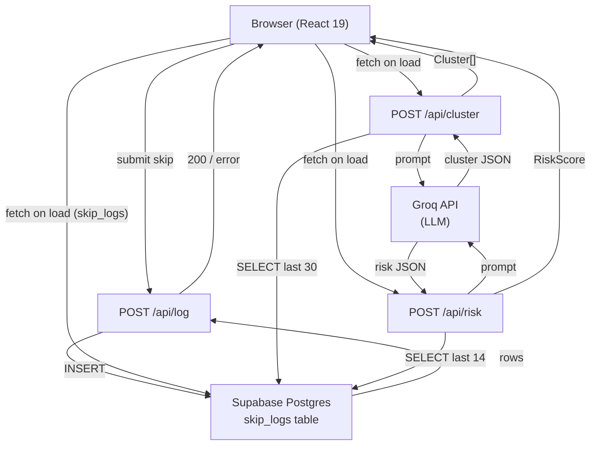
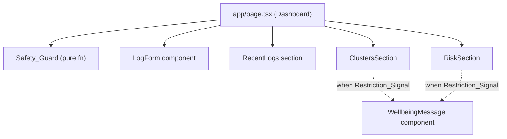
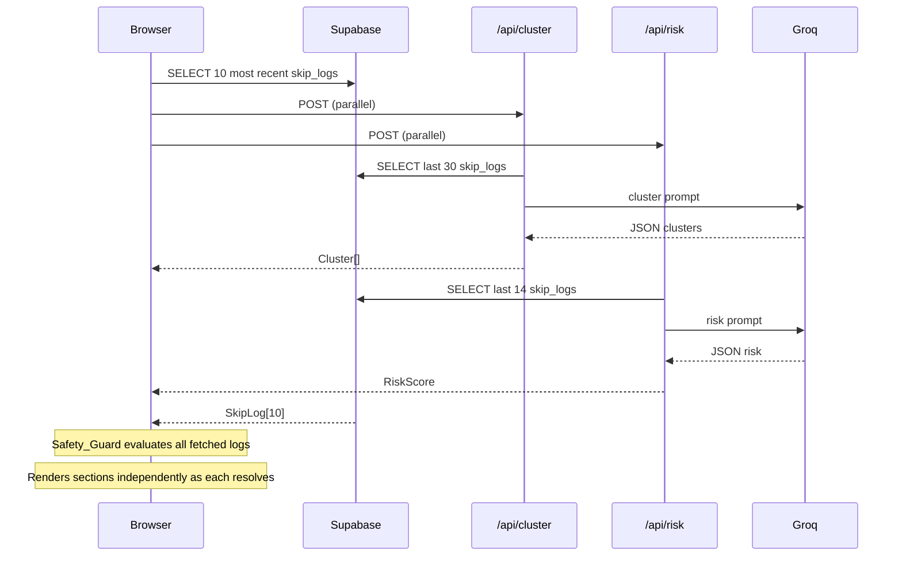

# Design Document — Meal-Spiral

## Overview

Meal-Spiral is a Next.js 16 App Router application that helps users recognise meal-skipping momentum before it becomes a health-impacting spiral. It is a pattern-awareness tool, not a calorie tracker.

The core loop is:
1. User logs a skipped meal with a free-text reason and meal type via the **Log_Form**.
2. The **Dashboard** reads recent logs from Supabase and fires two Groq-backed API routes in parallel — **Clusterer** and **Risk_Scorer** — to surface patterns and a risk level.
3. The **Safety_Guard** evaluates every Dashboard load for signs of deliberate restriction. When the Restriction_Signal is active, the Clusters and Risk sections are replaced by a supportive **Wellbeing_Message**; no LLM pattern data is shown.

All persistence goes through Supabase Postgres (`skip_logs` table). All LLM reasoning goes through Groq via server-only Next.js API routes so API keys never reach the browser.

---

## Architecture

### System Context Diagram



### Component Hierarchy



### Request / Data Flow



---

## Components and Interfaces

### File / Directory Structure

```
app/
├── page.tsx                    # Dashboard — client component, parallel fetches
├── layout.tsx                  # Root layout (already exists)
├── globals.css
│
├── components/
│   ├── LogForm.tsx             # Controlled form: reason text + meal type selector
│   ├── RecentLogs.tsx          # Displays last 10 skip logs
│   ├── ClustersSection.tsx     # Renders Cluster[] or WellbeingMessage
│   ├── RiskSection.tsx         # Renders RiskScore or WellbeingMessage
│   └── WellbeingMessage.tsx    # Supportive message, no clinical language
│
├── api/
│   ├── log/route.ts            # POST /api/log — insert skip log
│   ├── cluster/route.ts        # POST /api/cluster — Groq clustering
│   └── risk/route.ts           # POST /api/risk — Groq risk scoring
│
lib/
├── supabase.ts                 # Supabase client singleton
├── groq.ts                     # Groq client singleton
├── safety-guard.ts             # evaluateRestrictionSignal() pure function
└── types.ts                    # Shared TypeScript interfaces
```

### API Route Signatures

```typescript
// POST /api/log
// Body: { reason_text: string; meal_type: MealType }
// Returns: { success: true } | { error: string }

// POST /api/cluster
// Body: (none)
// Returns: Cluster[] | { error: string }

// POST /api/risk
// Body: (none)
// Returns: RiskScore | { error: string }
```

### Component Props

```typescript
// LogForm — no props (manages own state, calls /api/log)

// RecentLogs
interface RecentLogsProps {
  logs: SkipLog[];
  isLoading: boolean;
  error: string | null;
}

// ClustersSection
interface ClustersSectionProps {
  clusters: Cluster[];
  isLoading: boolean;
  error: string | null;
  restrictionActive: boolean;
}

// RiskSection
interface RiskSectionProps {
  riskScore: RiskScore | null;
  isLoading: boolean;
  error: string | null;
  restrictionActive: boolean;
}

// WellbeingMessage — no props
```

---

## Data Models

### TypeScript Interfaces (`lib/types.ts`)

```typescript
export type MealType = "breakfast" | "lunch" | "dinner";

export type RiskLevel = "low" | "medium" | "high";

/** Row shape returned from Supabase skip_logs table */
export interface SkipLog {
  id: string;
  created_at: string;          // ISO 8601 UTC timestamp
  reason_text: string;
  meal_type: MealType;
  day_of_week: string;         // e.g. "Monday"
}

/** A cluster of skip reasons with a user-language label */
export interface Cluster {
  label: string;               // Short phrase in user's own language
  reasons: string[];           // Original reason_text strings in this cluster
}

/** Risk assessment produced by the Risk_Scorer */
export interface RiskScore {
  risk_level: RiskLevel;
  explanation: string;         // Plain-language sentence, ≤ 60 words
}

/** Input supplied to the Groq risk prompt */
export interface RiskContext {
  streakDays: number;          // Consecutive days with at least one skip
  dayDistribution: Record<string, number>; // { Monday: 3, Tuesday: 1, ... }
  clusterLabels: string[];     // Active cluster labels for context
}

/** Return value of the Safety_Guard evaluation */
export interface GuardResult {
  restrictionActive: boolean;
  triggeredBy: "frequency" | "language" | null;
}
```

### Supabase Table (existing — do not migrate)

| Column        | Type        | Notes                              |
|---------------|-------------|------------------------------------|
| id            | uuid PK     | Generated by Supabase              |
| created_at    | timestamptz | Default: `now()`                   |
| reason_text   | text        | Free-text skip reason              |
| meal_type     | text        | `breakfast` \| `lunch` \| `dinner` |
| day_of_week   | text        | Derived from UTC date at insert    |

### Environment Variables

```
NEXT_PUBLIC_SUPABASE_URL      — Supabase project URL (safe for browser)
NEXT_PUBLIC_SUPABASE_ANON_KEY — Supabase anon key (safe for browser)
GROQ_API_KEY                  — Groq API key (server-only, never exposed to client)
```

The Supabase client used in API routes uses the same `NEXT_PUBLIC_*` variables because the anon key + Supabase row-level security is sufficient for this single-user prototype. `GROQ_API_KEY` is only accessed inside `lib/groq.ts`, which is only imported by server-side API route files.

---

## API Route Logic

### `POST /api/log` (`app/api/log/route.ts`)

```
1. Parse and validate request body: require non-empty reason_text, require meal_type ∈ {breakfast, lunch, dinner}
2. Derive day_of_week from new Date() UTC (e.g. "Monday")
3. Call supabase.from("skip_logs").insert({ reason_text, meal_type, day_of_week })
4. If insert error → return 500 { error: "Could not save log. Please try again." }
5. Return 200 { success: true }
```

### `POST /api/cluster` (`app/api/cluster/route.ts`)

```
1. SELECT reason_text FROM skip_logs ORDER BY created_at DESC LIMIT 30
2. If count < 3 → return 200 []
3. Build Groq prompt (see Prompt Templates below)
4. Call groq.chat.completions.create(...)
5. Parse response JSON into Cluster[]
   a. Validate shape: array of { label: string, reasons: string[] }
   b. If parse fails → return 500 { error: "Could not process patterns. Please try again." }
6. Return 200 Cluster[]
```

### `POST /api/risk` (`app/api/risk/route.ts`)

```
1. SELECT id, created_at, meal_type, day_of_week FROM skip_logs ORDER BY created_at DESC LIMIT 14
2. If count < 3 → return 200 { risk_level: "low", explanation: "Not enough data yet to assess a pattern." }
3. Compute streakDays: count consecutive calendar days (from today backwards) that each have ≥ 1 log
4. Compute dayDistribution: frequency count of day_of_week values
5. Fetch cluster labels by calling /api/cluster internally OR re-using cached result
   (implementation choice: pass cluster labels as derived from the same 14-log window for simplicity)
6. Build Groq prompt with { streakDays, dayDistribution, clusterLabels }
7. Call groq.chat.completions.create(...)
8. Parse response JSON into { risk_level, explanation }
   a. Validate risk_level ∈ { low, medium, high }; if not → default to "low", log unexpected value server-side
   b. Validate explanation ≤ 60 words; if not → truncate at word boundary
   c. If parse fails → return 500 { error: "Could not assess risk. Please try again." }
9. Return 200 RiskScore
```

### Safety_Guard (`lib/safety-guard.ts`)

```typescript
/**
 * Pure function — no I/O, no side effects.
 * Evaluates skip logs for restriction signals.
 *
 * @param last7DaysLogs  - All skip_logs within the last 7 calendar days
 * @param last14Logs     - The 14 most recent skip_logs (by created_at)
 * @returns GuardResult
 */
export function evaluateRestrictionSignal(
  last7DaysLogs: SkipLog[],
  last14Logs: SkipLog[]
): GuardResult

// Algorithm:
//
// FREQUENCY SIGNAL:
//   1. Build a set of calendar dates covered by last7DaysLogs
//   2. For each meal_type in [breakfast, lunch, dinner]:
//      Count distinct calendar days on which that meal_type was skipped
//   3. If ALL THREE meal types were skipped on ≥ 5 distinct days → frequency signal = true
//
// LANGUAGE SIGNAL:
//   RESTRICTION_PHRASES = ["not hungry", "don't want to", "don't feel like", "not interested"]
//   1. Count logs in last14Logs whose reason_text (lowercased) contains ANY restriction phrase
//   2. ratio = matchCount / last14Logs.length
//   3. If ratio ≥ 0.60 → language signal = true
//
// RESULT:
//   restrictionActive = frequency signal OR language signal
//   triggeredBy = "frequency" | "language" | null (first match wins)
```

---

## Groq Prompt Templates

### Clusterer Prompt

```
System:
You are a pattern-recognition assistant. Your job is to group meal-skipping reasons
into clusters using the user's own language — never use generic category names like
"work stress" unless those exact words appear in the entries.

Respond with ONLY valid JSON matching this schema:
[
  { "label": "<short phrase from user's own words>", "reasons": ["<reason1>", "<reason2>"] },
  ...
]
No explanation, no markdown, no code fences.

User:
Here are the recent meal-skipping reasons (one per line):
{reasons}

Group them into clusters. Each reason must appear in exactly one cluster.
Return the JSON array only.
```

### Risk Scorer Prompt

```
System:
You are a pattern-awareness assistant helping a user understand their meal-skipping
momentum. You are NOT a medical professional. Do not give medical advice.

Assess the risk level using exactly one of: low, medium, high.
Write a plain-language explanation of no more than 60 words.

Respond with ONLY valid JSON:
{ "risk_level": "low" | "medium" | "high", "explanation": "<≤60 words>" }
No explanation outside the JSON, no markdown, no code fences.

User:
Consecutive days with at least one skipped meal: {streakDays}
Days of the week distribution: {dayDistribution}
Recurring pattern labels: {clusterLabels}

Based on this momentum, assess the risk that this skipping pattern will escalate.
Return the JSON object only.
```

---

## Error Handling Strategy

| Layer | Scenario | Handling |
|---|---|---|
| Log_Form (client) | Empty reason submitted | Inline validation error; form not submitted |
| Log_Form (client) | No meal type selected | Inline validation error; form not submitted |
| Log_Form (client) | API returns 500 | Error message shown; user input preserved in fields |
| Log_Form (client) | API returns 200 | Confirmation message; fields reset |
| /api/cluster (server) | Supabase SELECT fails | Return 500 with plain-language message |
| /api/cluster (server) | Groq call fails | Return 500 with plain-language message |
| /api/cluster (server) | Groq returns malformed JSON | Return 500; do NOT expose raw LLM output or keys |
| /api/risk (server) | Supabase SELECT fails | Return 500 with plain-language message |
| /api/risk (server) | Groq call fails | Return 500 with plain-language message |
| /api/risk (server) | risk_level not in enum | Default to "low"; log unexpected value server-side |
| /api/risk (server) | explanation > 60 words | Truncate at word boundary server-side |
| Dashboard (client) | Any section fetch fails | Section-level error message; other sections unaffected |
| Dashboard (client) | Restriction_Signal active | Clusters + Risk replaced by Wellbeing_Message |

API routes MUST NOT expose:
- Raw Groq API responses
- Stack traces
- Environment variable values

---

## Wellbeing Message

When `restrictionActive === true`, both `ClustersSection` and `RiskSection` render `<WellbeingMessage />` instead of their normal content. Example text (non-clinical, non-diagnostic):

> "We've noticed a pattern in your recent logs that we want to gently acknowledge. If meal skipping has been feeling harder to step back from, you're not alone — and support is available. The National Alliance for Eating Disorders offers free resources and a helpline at [www.allianceforeatingdisorders.com](https://www.allianceforeatingdisorders.com)."

No `risk_level`, no cluster labels, no pattern scores appear while the signal is active.


---

## Correctness Properties

*A property is a characteristic or behavior that should hold true across all valid executions of a system — essentially, a formal statement about what the system should do. Properties serve as the bridge between human-readable specifications and machine-verifiable correctness guarantees.*

---

### Property 1: Form submission payload is well-formed

*For any* non-empty `reason_text` string and any `meal_type` in `{breakfast, lunch, dinner}`, submitting the Log_Form should call `POST /api/log` with a body containing exactly those values plus a `day_of_week` that is a valid English day name (`Monday`–`Sunday`).

**Validates: Requirements 1.2**

---

### Property 2: Whitespace-only reasons are rejected without a network call

*For any* string composed entirely of whitespace characters (including the empty string), submitting the Log_Form should show an inline validation error and make zero calls to the API route.

**Validates: Requirements 1.4**

---

### Property 3: API failure preserves user input

*For any* non-empty `reason_text` and any valid `meal_type`, if `POST /api/log` returns a 5xx response, the Log_Form should display an error message AND both the reason field and the meal-type selector should still contain the original values the user entered.

**Validates: Requirements 1.6**

---

### Property 4: Cluster JSON round-trip is lossless

*For any* valid `Cluster[]` value, serialising it with `JSON.stringify` and then deserialising with `JSON.parse` should produce a structurally and value-equivalent `Cluster[]` (same labels, same reason arrays in the same order).

**Validates: Requirements 2.7**

---

### Property 5: Clusterer prompt includes all reason strings

*For any* array of `reason_text` strings of length ≥ 3, when `POST /api/cluster` is called with those strings as the Supabase result, the prompt sent to the Groq client should contain every one of those exact reason strings.

**Validates: Requirements 2.2**

---

### Property 6: Malformed Groq cluster response never exposes raw output or keys

*For any* malformed Groq response (null body, non-JSON string, missing `label`/`reasons` fields, wrong types), `POST /api/cluster` should return HTTP 500 with a plain-language error message whose body does not contain the raw LLM output string and does not contain the `GROQ_API_KEY` value.

**Validates: Requirements 2.6**

---

### Property 7: Risk context derivation is correct for any log set

*For any* array of `SkipLog` records, the `streakDays` computed from those logs must equal the number of consecutive calendar days (counting backward from today) that each contain at least one log, and `dayDistribution` must be a frequency map where every `day_of_week` value in the input appears with the correct count.

**Validates: Requirements 3.2**

---

### Property 8: Invalid risk_level always defaults to "low"

*For any* string that is not a member of `{low, medium, high}`, the risk-level validation function should return `"low"` and not throw or propagate the invalid value.

**Validates: Requirements 3.6**

---

### Property 9: Recent logs render in reverse-chronological order with all required fields

*For any* array of `SkipLog` objects, the `RecentLogs` component should render each log with its `meal_type`, `day_of_week`, and `reason_text` visible, and the logs should appear in descending `created_at` order (most recent first).

**Validates: Requirements 4.1**

---

### Property 10: Cluster and Risk sections render all provided data

*For any* `Cluster[]`, the `ClustersSection` component renders every cluster's `label` and all of its `reasons` strings. *For any* `RiskScore`, the `RiskSection` component renders the `risk_level` indicator and the `explanation` text.

**Validates: Requirements 4.2, 4.3**

---

### Property 11: Section error isolation — failing sections do not suppress passing sections

*For any* combination of successful and errored fetch results across the three Dashboard sections (logs, clusters, risk), each section with a successful result renders its data, and each section with an error renders only its own error message without affecting the other sections.

**Validates: Requirements 4.5**

---

### Property 12: Restriction_Signal activates if and only if frequency or language threshold is met

*For any* set of skip logs that satisfies the frequency threshold (all three meal types skipped on ≥ 5 of the last 7 calendar days) OR the language threshold (≥ 60% of the most recent 14 reasons contain a restriction phrase), `evaluateRestrictionSignal` must return `restrictionActive: true`. Conversely, *for any* set of logs that satisfies neither threshold, the function must return `restrictionActive: false`.

**Validates: Requirements 5.2, 5.3, 5.7**

---

### Property 13: Active Restriction_Signal suppresses all pattern data in both affected sections

*For any* `Cluster[]` and `RiskScore`, when `restrictionActive` is `true`, both `ClustersSection` and `RiskSection` must render the `WellbeingMessage` content and must not render any cluster labels, cluster reasons, `risk_level` indicators, or `explanation` text.

**Validates: Requirements 4.6, 5.4, 5.6**

---

## Error Handling

See the **Error Handling Strategy** table in the API Route Logic section above. Key principles:

1. **No secret exposure** — API routes catch all errors before the response boundary; raw Groq output, stack traces, and env variable values never appear in HTTP responses.
2. **User input preservation** — client-side error handlers update error state without clearing form fields.
3. **Section independence** — Dashboard uses separate `useState` + `useEffect` (or `Promise.allSettled`) per section so one failure cannot prevent others from rendering.
4. **Graceful LLM degradation** — invalid `risk_level` values are clamped to `"low"` server-side; malformed JSON responses return a generic 500 without rethrowing the raw content.

---

## Testing Strategy

### Overview

This feature involves pure business-logic functions (Safety_Guard, risk-level validator, streak computation), LLM response parsers, and React components. That mix is well-suited for a **dual approach**:

- **Property-based tests** for universal invariants that should hold across a wide range of inputs (parsers, guard thresholds, validation logic, rendering completeness).
- **Example-based unit tests** for specific scenarios, UI interactions, and error states.
- **Integration tests** (manual or with a test Supabase project) for route-level DB wiring.

### Recommended Library

**Vitest** is the natural choice for this Next.js + TypeScript project. For property-based testing, add **[fast-check](https://fast-check.dev/)** — a mature, TypeScript-first PBT library with zero additional runtime dependencies.

```bash
npm install --save-dev vitest @vitejs/plugin-react fast-check @testing-library/react @testing-library/jest-dom jsdom
```

Add to `package.json`:
```json
"scripts": {
  "test": "vitest --run"
}
```

### Property-Based Test Configuration

- Minimum **100 iterations** per property test (fast-check default is 100; keep it or raise to 200 for threshold logic).
- Tag each test with a comment referencing its design property.
- Tag format: `// Feature: meal-spiral, Property {N}: {property_title}`

Example skeleton:

```typescript
import fc from "fast-check";
import { evaluateRestrictionSignal } from "@/lib/safety-guard";

// Feature: meal-spiral, Property 12: Restriction_Signal activates if and only if frequency or language threshold is met
it("activates restriction signal when language threshold is met", () => {
  fc.assert(
    fc.property(
      fc.array(fc.record({ ... }), { minLength: 14, maxLength: 14 }),
      (logs) => {
        // arrange: ensure ≥60% of reasons contain a restriction phrase
        // act: call evaluateRestrictionSignal
        // assert: restrictionActive === true
      }
    ),
    { numRuns: 200 }
  );
});
```

### Unit Test Focus Areas

| Area | Test type | Notes |
|---|---|---|
| LogForm renders correctly | Example | Three meal-type options present |
| LogForm confirms on success | Example | Mock API 200, check reset + message |
| LogForm no meal type error | Example | Leave select empty, check inline error |
| Groq client not called when < 3 logs | Edge case | 0, 1, 2 log scenarios |
| Risk default response when < 3 logs | Edge case | Returns `{ risk_level: "low", explanation: "..." }` |
| WellbeingMessage renders helpline URL | Example | NEDA URL present in output |
| WellbeingMessage hides risk/cluster data | Example | No risk_level, no cluster labels rendered |
| Dashboard parallel fetch loading states | Example | Each section shows loading independently |

### Integration Test Approach

API routes that depend on Supabase and Groq should be tested at the integration level with mocked clients (using `vi.mock`):

- Mock `lib/supabase.ts` to return controlled row sets.
- Mock `lib/groq.ts` to return controlled LLM responses.
- Test the full route handler logic end-to-end including error paths.

Full end-to-end tests against a real Supabase project should be run manually before deployment.
